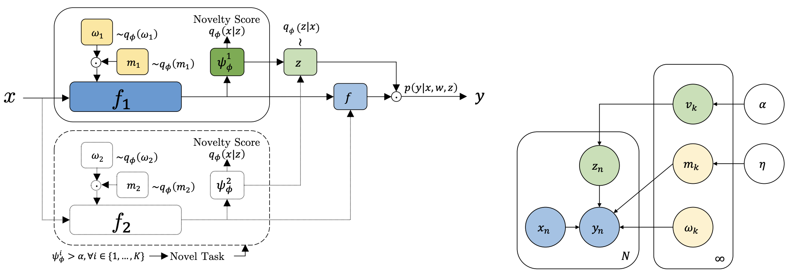

# VariGrow
### Variational Architecture Growing for Task-Agnostic Continual Learning based on Bayesian Novelty



Continual Learning (CL) is the problem of sequentially learning a set of tasks and preserving all the knowledge acquired. Many existing methods assume that the data stream is explicitly divided into a sequence of known contexts (tasks), and use this information to know when to transfer knowledge from one context to another. Unfortunately, many real-world CL scenarios have no clear task nor context boundaries, motivating the study of task-agnostic CL, where neither the specific tasks nor their switches are known both in training and testing. This paper proposes a variational architecture growing framework dubbed VariGrow. By interpreting dynamically growing neural networks as a Bayesian approximation, and defining flexible implicit variational distributions, VariGrow detects if a new task is arriving through an energy-based novelty score. If the novelty score is high and the sample is “detected" as a new task, VariGrow will grow a new expert module to be responsible for it. Otherwise, the sample will be assigned to one of the existing experts who is most “familiar" with it (i.e., one with the lowest novelty score). We have tested VariGrow on several CIFAR and ImageNet-based benchmarks for the strict task-agnostic CL setting and demonstrate its consistent superior performance. Perhaps surprisingly, its performance can even be competitive compared to task-aware methods.

## Usage

- Run `pip install -r requirements.txt`
- Run `bash run.sh`

## Citation

If you found this work informative or useful, please consider citing the following paper:

```
@InProceedings{pmlr-v162-ardywibowo22a,
  title = 	 {{V}ari{G}row: Variational Architecture Growing for Task-Agnostic Continual Learning based on {B}ayesian Novelty},
  author =       {Ardywibowo, Randy and Huo, Zepeng and Wang, Zhangyang and Mortazavi, Bobak J and Huang, Shuai and Qian, Xiaoning},
  booktitle = 	 {Proceedings of the 39th International Conference on Machine Learning},
  pages = 	 {865--877},
  year = 	 {2022},
  editor = 	 {Chaudhuri, Kamalika and Jegelka, Stefanie and Song, Le and Szepesvari, Csaba and Niu, Gang and Sabato, Sivan},
  volume = 	 {162},
  series = 	 {Proceedings of Machine Learning Research},
  month = 	 {17--23 Jul},
  publisher =    {PMLR},
  pdf = 	 {https://proceedings.mlr.press/v162/ardywibowo22a/ardywibowo22a.pdf},
  url = 	 {https://proceedings.mlr.press/v162/ardywibowo22a.html}
```
